# 第六次实验

## 实验目的

> 本章重点介绍了EL表达式和JSTL核心标签库的用法。 EL与JSTL的应用大大提高了编程效率，并且降低了维护难度。实验内容包括：

1. EL隐含对象的使用。
2. JSP标准标签库JSTL。
3. 实现文件的上传和下载功能。
4. 教材第8章的所有例题需要调试通过。

## 前置配置

### web.xml

```xml
<?xml version="1.0" encoding="UTF-8"?>
<web-app xmlns="https://jakarta.ee/xml/ns/jakartaee"
         xmlns:xsi="http://www.w3.org/2001/XMLSchema-instance"
         xsi:schemaLocation="https://jakarta.ee/xml/ns/jakartaee https://jakarta.ee/xml/ns/jakartaee/web-app_6_0.xsd"
         version="6.0">
    <jsp-config>
        <taglib>
            <taglib-uri>http://java.sun.com/jsp/jstl/core</taglib-uri>
            <taglib-location>/WEB-INF/c.tld</taglib-location>
        </taglib>
    </jsp-config>
</web-app>
```


## 实验内容

### 编写1个Servlet，在该Servlet中使用request对象存储数据，然后从该Servlet转发到show.jsp页面，在show.jsp页面中显示request对象的数据。首先，运行Servlet，在IE地址栏中输入：http://\<HostServer>/\<servletProject>/saveServlet。

#### 源代码

```jsp
<%@ page contentType="text/html;charset=UTF-8" language="java" %>
<%@ taglib prefix="c" uri="http://java.sun.com/jsp/jstl/core" %>
<html>
<head>
  <title>显示数据</title>
</head>
<body>
<h3>从Servlet转发过来的request内置对象的数据如下：</h3>
<ul>
  <c:forEach var="name" items="${names}">
    <li>${name}</li>
  </c:forEach>
</ul>
</body>
</html>
```

```java
package com.xlf.experiment6;

import jakarta.servlet.ServletException;
import jakarta.servlet.annotation.WebServlet;
import jakarta.servlet.http.HttpServlet;
import jakarta.servlet.http.HttpServletRequest;
import jakarta.servlet.http.HttpServletResponse;

import java.io.IOException;

@WebServlet("/saveServlet")
public class SaveServlet extends HttpServlet {
    @Override
    protected void doGet(HttpServletRequest request, HttpServletResponse response) throws ServletException, IOException {
        String[] names = {"zhao", "qian", "sun", "li"};
        request.setAttribute("names", names);
        request.getRequestDispatcher("/show.jsp").forward(request, response);
    }
}
```

#### 截图

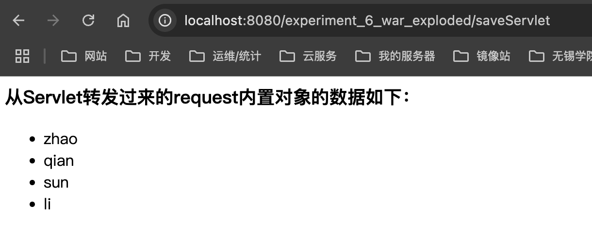


### 编写一个JSP页面 \ifelse.jsp，在该页面中使用 \<c:set>标签把两个字符串设置为request范围内的变量。使用<c:if>标签求出这两个字符串的最大值（按字典顺序比较大小），使用<c:choose>、<c:when>及<c:otherwise>标签求出这两个字符串的最小值。

#### 源代码

```jsp
<%@ taglib prefix="c" uri="http://java.sun.com/jsp/jstl/core" %>
<%@ page contentType="text/html;charset=UTF-8" language="java" %>
<html>
<head>
  <title>字符串比较</title>
</head>
<body>
<c:set var="str1" value="apple" scope="request" />
<c:set var="str2" value="banana" scope="request" />

<h3>字符串比较结果：</h3>

<c:if test="${str1 > str2}">
  <p>较大的字符串是：${str1}</p>
</c:if>
<c:if test="${str1 <= str2}">
  <p>较大的字符串是：${str2}</p>
</c:if>

<c:choose>
  <c:when test="${str1 < str2}">
    <p>较小的字符串是：${str1}</p>
  </c:when>
  <c:otherwise>
    <p>较小的字符串是：${str2}</p>
  </c:otherwise>
</c:choose>
</body>
</html>
```

#### 截图

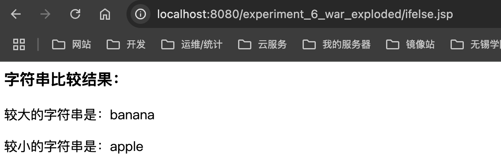


### 单文件上传

#### 源代码

```jsp
<%@ page contentType="text/html;charset=UTF-8" language="java" %>
<html>
<head>
    <title>文件上传</title>
</head>
<body>
<form action="uploadHttpOneServlet" method="post" enctype="multipart/form-data">
    <p>文件描述：<input type="text" name="description" /></p>
    <p>请选择文件：<input type="file" name="file" /></p>
    <input type="reset" value="重填" />
    <input type="submit" value="上传" />
</form>
</body>
</html>
```

```java
package com.xlf.experiment6;

import jakarta.servlet.ServletException;
import jakarta.servlet.annotation.MultipartConfig;
import jakarta.servlet.annotation.WebServlet;
import jakarta.servlet.http.HttpServlet;
import jakarta.servlet.http.HttpServletRequest;
import jakarta.servlet.http.Part;

import java.io.File;
import java.io.IOException;
import java.io.PrintWriter;

@WebServlet("/uploadHttpOneServlet")
@MultipartConfig
public class UploadHttpOneServlet extends HttpServlet {
    private static final String UPLOAD_DIR = "uploadFiles";

    @Override
    protected void doPost(HttpServletRequest request, jakarta.servlet.http.HttpServletResponse response) throws ServletException, IOException {
        String uploadPath = getServletContext().getRealPath("") + File.separator + UPLOAD_DIR;

        File uploadDir = new File(uploadPath);
        if (!uploadDir.exists()) {
            uploadDir.mkdir();
        }

        String description = request.getParameter("description");
        Part filePart = request.getPart("file");
        String fileName = filePart.getSubmittedFileName();

        filePart.write(uploadPath + File.separator + fileName);

        response.setContentType("text/html;charset=UTF-8");
        PrintWriter out = response.getWriter();
        out.println("<html><body>");
        out.println("<h3>输入的文件描述：" + description + "</h3>");
        out.println("<p>上传文件的原始名称：" + fileName + "</p>");
        out.println("<p>文件上传到：" + uploadPath + File.separator + fileName + "</p>");
        out.println("</body></html>");
    }
}
```

#### 截图

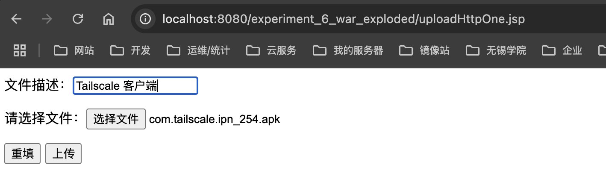

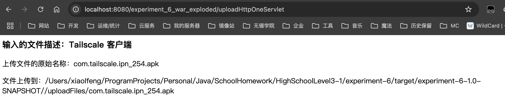


### **首先将**题目3中上传到服务器uploadFiles目录中的文件列举到页面，然后单击页面中的下载链接下载文件。

#### 源代码

```java
package com.xlf.experiment6;

import jakarta.servlet.ServletException;
import jakarta.servlet.annotation.WebServlet;
import jakarta.servlet.http.HttpServlet;
import jakarta.servlet.http.HttpServletRequest;
import jakarta.servlet.http.HttpServletResponse;

import java.io.File;
import java.io.IOException;
import java.io.PrintWriter;

@WebServlet("/showDownServlet")
public class ShowDownServlet extends HttpServlet {
    private static final String UPLOAD_DIR = "uploadFiles";

    @Override
    protected void doGet(HttpServletRequest request, HttpServletResponse response) throws ServletException, IOException {
        String uploadPath = getServletContext().getRealPath("") + File.separator + UPLOAD_DIR;
        File uploadDir = new File(uploadPath);

        response.setContentType("text/html;charset=UTF-8");
        PrintWriter out = response.getWriter();
        out.println("<html><body>");
        out.println("<h3>显示下载文件</h3>");
        out.println("<table border='1'><tr><th>文件名称</th><th>下载操作</th></tr>");

        if (uploadDir.exists() && uploadDir.isDirectory()) {
            for (File file : uploadDir.listFiles()) {
                out.println("<tr><td>" + file.getName() + "</td>");
                out.println("<td><a href='downloadFileServlet?fileName=" + file.getName() + "'>下载</a></td></tr>");
            }
        }

        out.println("</table>");
        out.println("</body></html>");
    }
}
```

```java
package com.xlf.experiment6;

import jakarta.servlet.ServletException;
import jakarta.servlet.annotation.WebServlet;
import jakarta.servlet.http.HttpServlet;
import jakarta.servlet.http.HttpServletRequest;
import jakarta.servlet.http.HttpServletResponse;

import java.io.File;
import java.io.FileInputStream;
import java.io.IOException;
import java.io.OutputStream;

@WebServlet("/downloadFileServlet")
public class DownloadFileServlet extends HttpServlet {
    private static final String UPLOAD_DIR = "uploadFiles";

    @Override
    protected void doGet(HttpServletRequest request, HttpServletResponse response) throws ServletException, IOException {
        String fileName = request.getParameter("fileName");
        String filePath = getServletContext().getRealPath("") + File.separator + UPLOAD_DIR + File.separator + fileName;

        File file = new File(filePath);
        if (file.exists()) {
            response.setContentType("application/octet-stream");
            response.setHeader("Content-Disposition", "attachment;filename=" + fileName);

            try (FileInputStream fis = new FileInputStream(file); OutputStream os = response.getOutputStream()) {
                byte[] buffer = new byte[4096];
                int bytesRead;
                while ((bytesRead = fis.read(buffer)) != -1) {
                    os.write(buffer, 0, bytesRead);
                }
            }
        } else {
            response.getWriter().write("文件不存在！");
        }
    }
}
```

#### 截图

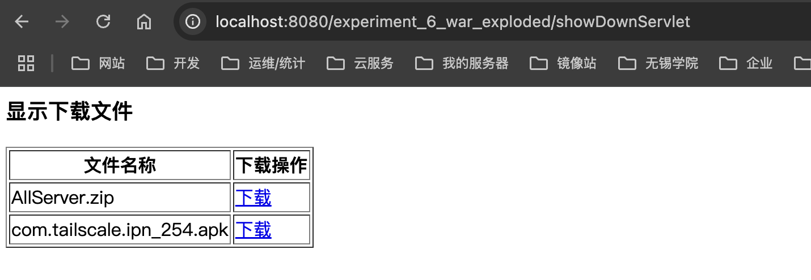


### 第八章测试题调试通过

#### 8-1

##### 源代码

```jsp
<%@ page language="java" contentType="text/html; charset=UTF-8"
    pageEncoding="UTF-8"%>
<!DOCTYPE html>
<html>
<head>
<meta http-equiv="Content-Type" content="text/html; charset=UTF-8">
<title>Insert title here</title>
</head>
<body>
<%
pageContext.setAttribute("pageScopeData", "data in pageScope");
request.setAttribute("requestScopeData", "data in requestScope");
session.setAttribute("sessionScopeData", "data in sessionScope");
application.setAttribute("applicationScopeData", "data in applicationScope");
Cookie cookieData=new Cookie("cookieData","datacookie");
response.addCookie(cookieData);
%>
pageScope的数据是${pageScope.pageScopeData }<br>
requestScope的数据是${requestScope.requestScopeData }<br>
sessionScope的数据是${sessionScope.sessionScopeData }<br>
applicationScope的数据是${applicationScope.applicationScopeData }<br>
cookie的数据是${cookie.cookieData.value }<br>
传递的参数数据是${param.paramData }<br>
</body>
</html>
```

##### 截图

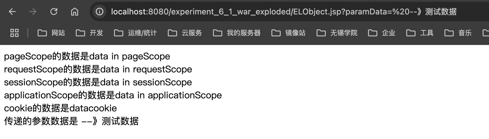


#### 8-2

##### 源代码

```java
package com.xlf.experiment61;

import java.io.Serializable;

public class Goods implements Serializable {

	/**
	 *
	 */
	private static final long serialVersionUID = 2198443318403659291L;
	private int gid;
	private String gname;
	private double gprice;
	private int gcount;
	public int getGid() {
		return gid;
	}
	public void setGid(int gid) {
		this.gid = gid;
	}
	public String getGname() {
		return gname;
	}
	public void setGname(String gname) {
		this.gname = gname;
	}
	public double getGprice() {
		return gprice;
	}
	public void setGprice(double gprice) {
		this.gprice = gprice;
	}
	public int getGcount() {
		return gcount;
	}
	public void setGcount(int gcount) {
		this.gcount = gcount;
	}
}
```

```jsp
<%@ page language="java" contentType="text/html; charset=UTF-8"
    pageEncoding="UTF-8"%>
    <%@page import="com.xlf.experiment61.Goods" %>
<!DOCTYPE html>
<html>
<head>
<meta http-equiv="Content-Type" content="text/html; charset=UTF-8">
<title>Insert title here</title>
</head>
<body>
<%
Goods goods=new Goods();
goods.setGid(1001);
goods.setGname("小米10");
session.setAttribute("goods", goods);
%>
商品编码:${goods.gid }<br>
商品名称:${goods.gname }<br>
</body>
</html>
```

##### 截图

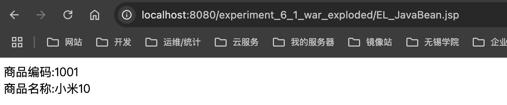

#### 8-3

##### 源代码

```jsp
<%@ page language="java" contentType="text/html; charset=UTF-8"
    pageEncoding="UTF-8"%>
     <%@page import="com.xlf.experiment61.Goods,java.util.ArrayList" %>
<!DOCTYPE html>
<html>
<head>
<meta http-equiv="Content-Type" content="text/html; charset=UTF-8">
<title>Insert title here</title>
</head>
<body>
<%
ArrayList<Goods>goodsList=new ArrayList<Goods>();
for(int i=8;i<=10;i++){
	Goods goods=new Goods();
	goods.setGid(1000+i);
	goods.setGname("小米"+Integer.toString(i));
	goodsList.add(goods);
}
session.setAttribute("goodsList", goodsList);
%>
第1个商品编号为:${goodsList[0].gid }
商品名称:${goodsList[0].gname }<br>
第2个商品编号为:${goodsList[1].gid }
商品名称:${goodsList[1].gname }<br>
第3个商品编号为:${goodsList[2].gid }
商品名称:${goodsList[2].gname }<br>
</body>
</html>
```

##### 截图

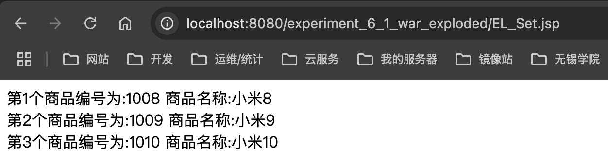


#### 8-4

##### 源代码

```jsp
<%@ page language="java" contentType="text/html; charset=UTF-8"
    pageEncoding="UTF-8"%>
    <%@ taglib prefix="c" uri="http://java.sun.com/jsp/jstl/core" %>
<!DOCTYPE html>
<html>
<head>
<meta http-equiv="Content-Type" content="text/html; charset=UTF-8">
<title>Insert title here</title>
</head>
<body>
<%session.setAttribute("msg", "<u>转义字符是否使用<u>"); %>
<c:out value="${a}" default="此时输出默认值"></c:out><br>
<c:out value="${msg }"></c:out><br>
<c:out value="${msg }" escapeXml="false"></c:out><br>
</body>
</html>
```

##### 截图

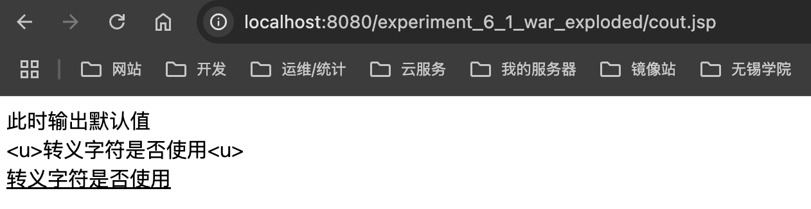


#### 8-5

##### 源代码

```jsp
<%@ page language="java" contentType="text/html; charset=UTF-8"
    pageEncoding="UTF-8"%>
    <%@ taglib prefix="c" uri="http://java.sun.com/jsp/jstl/core" %>
<!DOCTYPE html>
<html>
<head>
<meta http-equiv="Content-Type" content="text/html; charset=UTF-8">
<title>Insert title here</title>
</head>
<body>
<%session.setAttribute("gender", "male"); %>
性别:<c:if test="${gender=='male' }">男</c:if>
         <c:if test="${gender=='female' }">女</c:if>
</body>
</html>
```

##### 截图

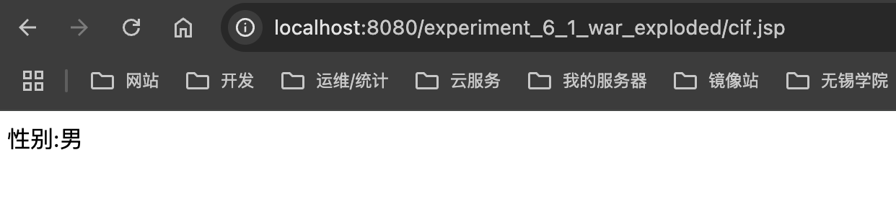


#### 8-6

##### 源代码

```jsp
<%@ page language="java" contentType="text/html; charset=UTF-8"
    pageEncoding="UTF-8"%>
    <%@ taglib prefix="c" uri="http://java.sun.com/jsp/jstl/core" %>
<!DOCTYPE html>
<html>
<head>
<meta http-equiv="Content-Type" content="text/html; charset=UTF-8">
<title>Insert title here</title>
</head>
<body>
<%session.setAttribute("score",75); %>
成绩等级为:
<c:choose>
<c:when test="${score>=85&&score<=100 }">优秀</c:when>
<c:when test="${score>=75&&score<=84 }">良好</c:when>
<c:when test="${score>=60&&score<=74 }">及格</c:when>
<c:otherwise>不及格</c:otherwise>
</c:choose>
</body>
</html>
```

##### 截图

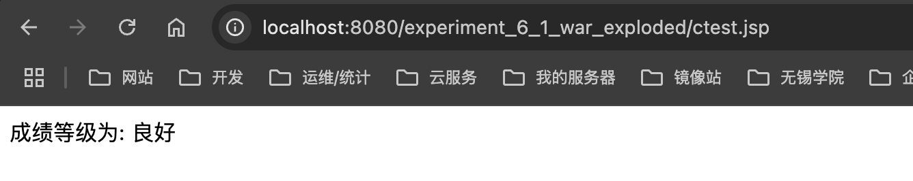


#### 8-7

##### 源代码

```jsp
<%@ page language="java" contentType="text/html; charset=UTF-8"
    pageEncoding="UTF-8"%>
       <%@ taglib prefix="c" uri="http://java.sun.com/jsp/jstl/core" %>
       <%@page import="com.xlf.experiment61.Goods,java.util.ArrayList" %>
<!DOCTYPE html>
<html>
<head>
<meta http-equiv="Content-Type" content="text/html; charset=UTF-8">
<title>Insert title here</title>
</head>
<body>
<%
ArrayList<Goods>goodsList=new ArrayList<Goods>();
for(int i=8;i<=10;i++){
	Goods goods=new Goods();
	goods.setGid(1000+i);
	goods.setGname("小米"+Integer.toString(i));
	//goods.setGprice(i*200);
	goodsList.add(goods);
}
session.setAttribute("goodsList", goodsList);
%>
<c:forEach items="${goodsList }" var="goods" varStatus="goodsStatus">
第${goodsStatus.count}个
商品编号:${goods.gid}
商品名称${goods.gname }<br>
<%-- 商品价格 ${goods.gprice }<br> --%>
</c:forEach>
</body>
</html>
```

##### 截图

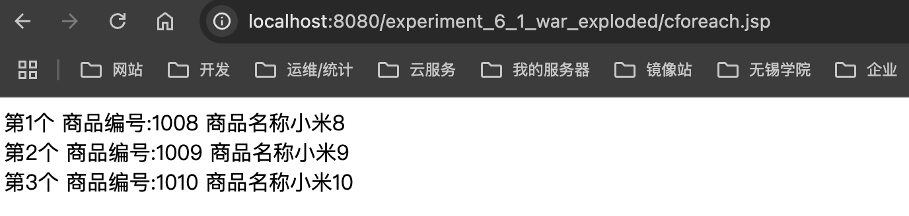

#### 8-8

##### 源代码

```jsp
<%@ page language="java" contentType="text/html; charset=UTF-8"
    pageEncoding="UTF-8"%>
    <%@ taglib prefix="c" uri="http://java.sun.com/jsp/jstl/core" %>
<!DOCTYPE html>
<html>
<head>
<meta http-equiv="Content-Type" content="text/html; charset=UTF-8">
<title>Insert title here</title>
</head>
<body>
<c:forTokens items="小米10,华为P30,荣耀30" delims="," var="goodsname">
<c:out value="${goodsname}"></c:out><br>
</c:forTokens>
</body>
</html>
```

##### 截图

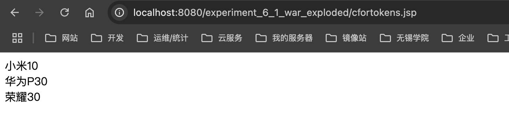
